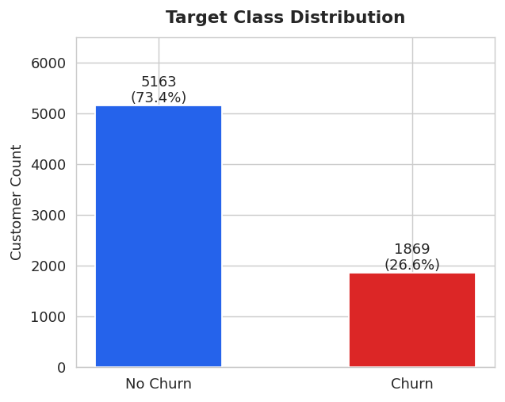
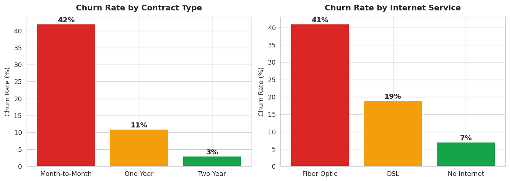
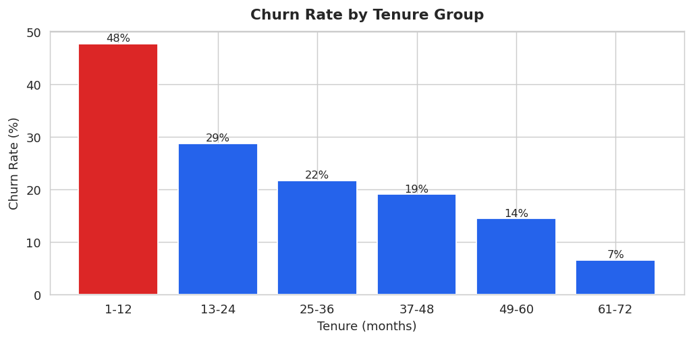
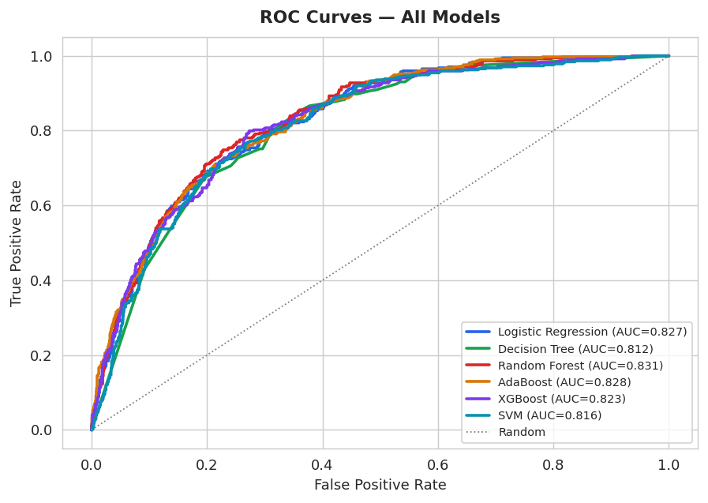
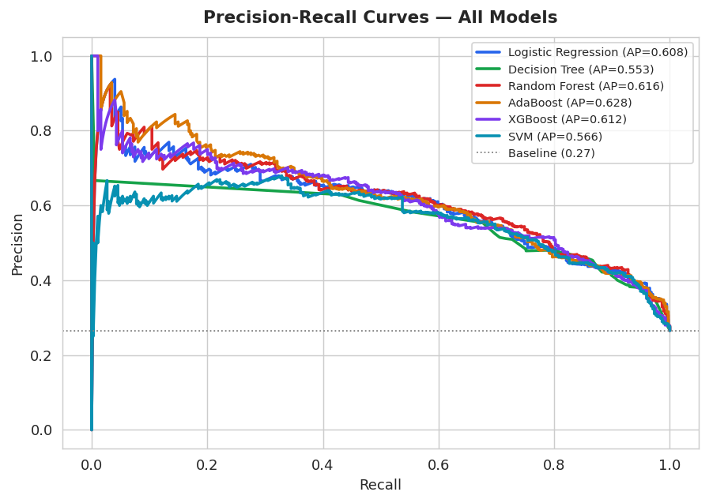
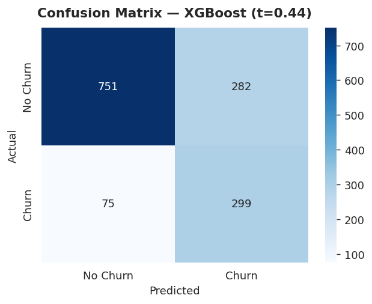
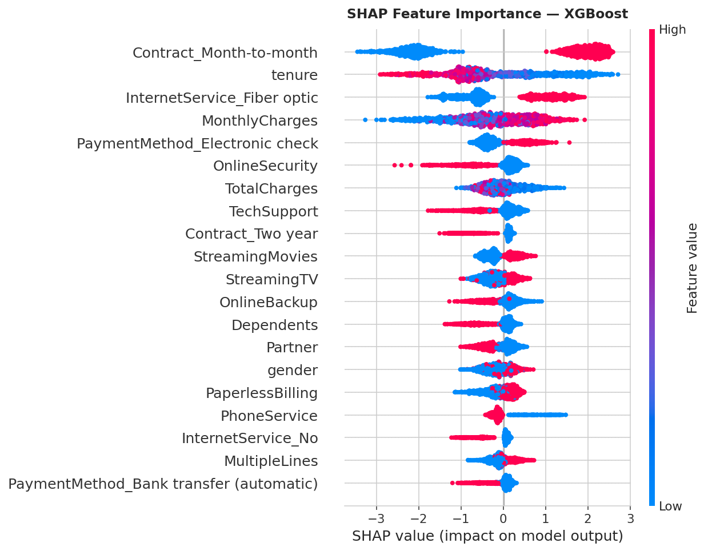
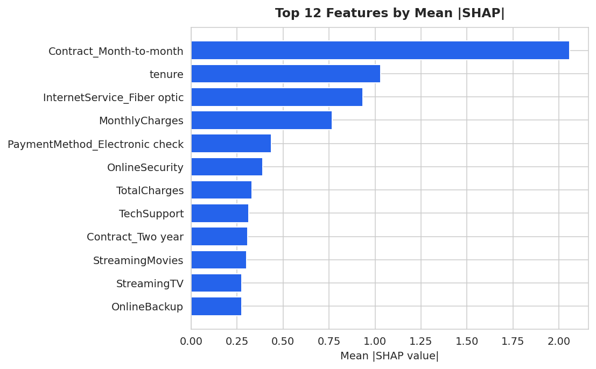

# 📡 Telco Customer Churn Prediction

**Predicting which telecom customers are at risk of leaving — before they do.**

> **Authors:** Tsion Woldeselassie & Aelroe Zewdie  
> **Course:** DATA 4382 — Applied Statistics & Data Science, Spring 2026  
> **Final Model:** XGBoost + SMOTEENN | ROC-AUC: 0.8233 | F1: 0.6208 | Recall: 0.7834

---

## 📋 Table of Contents
1. [Business Problem](#business-problem)
2. [Project Overview](#project-overview)
3. [Data](#data)
4. [Data Preprocessing](#data-preprocessing)
5. [Exploratory Data Analysis](#exploratory-data-analysis)
6. [Modeling Approach](#modeling-approach)
7. [Model Training](#model-training)
8. [Results](#results)
9. [Model Interpretation](#model-interpretation)
10. [Key Insights](#key-insights)
11. [Conclusion](#conclusion)
12. [Future Work](#future-work)
13. [How to Run](#how-to-run)
14. [Repository Structure](#repository-structure)
15. [Requirements](#requirements)

---

## 🏢 Business Problem

Customer churn — when a subscriber cancels their service — is one of the most expensive problems in the telecom industry. Acquiring a new customer costs **5 to 7 times more** than keeping an existing one. A company losing 26.5% of its customers annually is leaving significant revenue on the table.

**The core question this project answers:**  
*Which customers are at risk of leaving — and why — so the retention team can act before it's too late?*

**What happens if this is ignored:**  
Without an early warning system, the retention team can only react after a customer has already decided to leave. By then, the cost of winning them back — if possible at all — is far higher than a proactive offer would have been.

---

## 🎯 Project Overview

This project builds a complete, end-to-end machine learning pipeline that:

1. **Predicts** which customers are likely to churn using an XGBoost classifier
2. **Explains** why each customer is at risk using SHAP values (not just a black-box score)
3. **Deploys** a working Streamlit web application that a retention team can use in real time

The model was trained on 7,032 real telecom customer records and evaluated on a held-out test set of **1,407 real customers — no synthetic data in the evaluation**.

| Metric | Value |
|--------|-------|
| ROC-AUC | **0.8233** |
| F1 Score (churn class) | **0.6208** |
| Recall (churn class) | **0.7834** |
| Average Precision | **0.6116** |
| Decision Threshold | **0.44** |

---

## 📊 Data

| Item | Detail |
|------|--------|
| **Source** | [IBM Telco Customer Churn — Kaggle](https://www.kaggle.com/datasets/blastchar/telco-customer-churn) |
| **Type** | Tabular, classification |
| **Size** | 7,043 rows × 21 columns (7,032 after cleaning) |
| **Target** | `Churn` — binary (Yes/No) |
| **Class balance** | 73.5% No Churn / 26.5% Churn (imbalanced) |

**Key features:**
- **Contract type** — Month-to-month, one year, two year
- **Internet service** — Fiber optic, DSL, none
- **Tenure** — How long the customer has been with the company (months)
- **Monthly charges** — Current monthly bill
- **Add-on services** — Online Security, Tech Support, Streaming TV, etc.
- **Payment method** — Electronic check, auto-pay, mailed check

---

## 🔧 Data Preprocessing

### Cleaning

- `TotalCharges` was stored as a string (object dtype). Converting to numeric revealed **11 rows with blank values** — all had `tenure = 0` and none had churned. These were dropped (0.16% of data).
- `customerID` was dropped — it carries no predictive information.

### Handling "No internet service"

Several service columns (`OnlineSecurity`, `TechSupport`, `DeviceProtection`, etc.) had three possible values: `Yes`, `No`, and `No internet service`. The third value is **redundant** with the `InternetService` column — it conveys the same information. We collapsed it to `No` before encoding to avoid creating uninformative dummy variables.

### Encoding

- **Binary columns** (Yes/No, Male/Female): label-encoded as 0/1
- **Multi-class columns** (`InternetService`, `Contract`, `PaymentMethod`): one-hot encoded with `drop_first=False` to preserve interpretability
- **`tenure_group`**: created for EDA visualization only — excluded from all model features

### Why this matters
> A common mistake is to apply `get_dummies` on the raw data before handling the "No internet service" values. Doing so creates a `OnlineSecurity_No internet service` column that is perfectly correlated with `InternetService_No` — adding noise without information.

---

## 📈 Exploratory Data Analysis

### Class Distribution

The dataset is imbalanced — 26.5% of customers churned. This directly informed our decision to use SMOTEENN resampling.



### Churn Rate by Key Features

The two most striking patterns in the raw data:

- **Month-to-month contracts** churn at **42%** — vs 11% for one-year and just 3% for two-year contracts
- **Fiber optic customers** churn at **41%** — vs 19% for DSL



**Why this matters for the model:** Contract type and internet service are not just features — they are the dominant churn signals. Any model that doesn't weight these heavily is not learning the right thing.

### Churn Rate by Tenure

New customers are the highest-risk group. Customers in their **first 12 months** churn at dramatically higher rates. After year 3, churn drops sharply. Loyalty compounds over time.



**Business takeaway:** The retention team should prioritize customers in their first year — especially those on month-to-month contracts.

---

## 🤖 Modeling Approach

### Why We Can't Just Use Accuracy

With 73.5% of customers not churning, a model that always predicts "No Churn" achieves **73.5% accuracy for free** — without learning anything useful. We chose **F1 score (churn class)** as our primary metric because it penalizes both missing churners and generating false alarms equally.

### Baseline Model
**Logistic Regression** — chosen as the baseline because it is simple, interpretable, and provides probability estimates. It establishes the minimum performance bar that any more complex model must beat.

### Advanced Models Evaluated

| Model | Why chosen |
|-------|-----------|
| Decision Tree | Interpretable, fast, good for feature interaction baseline |
| Random Forest | Robust ensemble, handles imbalance relatively well |
| AdaBoost | Focuses on hard-to-classify examples — useful for minority class |
| **XGBoost** ✓ | Best F1 and competitive AUC; handles mixed feature types well |
| SVM | Strong theoretical foundation for binary classification |

### Handling Class Imbalance — SMOTEENN

We used **SMOTEENN** to balance the training set:
- **SMOTE** (Synthetic Minority Oversampling Technique): creates new minority class samples by interpolating between real churners
- **ENN** (Edited Nearest Neighbors): cleans noisy majority class samples near the decision boundary

**Critical:** SMOTEENN was applied **only to the training fold**. The test set contains only real customer records. Evaluating on synthetic data inflates results — a mistake we explicitly avoided.

```
Before SMOTEENN: 4,130 no-churn | 1,495 churn
After  SMOTEENN: 2,297 no-churn | 2,839 churn
```

---

## ⚙️ Model Training

### Tools Used
- `scikit-learn` — preprocessing, baseline models, evaluation
- `xgboost` — gradient boosting classifier
- `imbalanced-learn` — SMOTEENN resampling
- `shap` — model interpretability
- `joblib` — model serialization

### Pipeline Order (Critical for Correctness)
```
1. Stratified 80/20 train/test split  (random_state=42)
2. StandardScaler → fit on train only, transform both
3. SMOTEENN → applied to train fold only
4. Train all models on resampled training data
5. Evaluate all models on original 1,407 real test customers
```

### Hyperparameter Tuning — XGBoost

Used `RandomizedSearchCV` with 5-fold stratified cross-validation across 20 parameter combinations, optimizing for ROC-AUC:

```python
xgb_params = {
    'n_estimators':     [200, 300, 400],
    'max_depth':        [4, 5, 6],
    'learning_rate':    [0.01, 0.05, 0.1],
    'subsample':        [0.7, 0.8, 0.9],
    'colsample_bytree': [0.7, 0.8, 0.9],
    'min_child_weight': [1, 3, 5],
}
```

**Best configuration:** `n_estimators=300`, `max_depth=6`, `learning_rate=0.1`, `subsample=0.9`, `colsample_bytree=0.8`

### Threshold Optimisation

The default 0.50 threshold is rarely optimal for imbalanced problems. We swept thresholds from 0.10 to 0.70 and selected the point that maximizes churn-class F1. **Optimal threshold: 0.44.**

---

## 📉 Results

### Why These Metrics?

| Metric | Why we use it |
|--------|--------------|
| **ROC-AUC** | Measures ranking ability across all thresholds. 0.82 means the model correctly ranks a random churner above a random non-churner 82% of the time. Threshold-independent. |
| **F1 (churn)** | Harmonic mean of precision and recall. Penalises both missing churners and false alarms. Our primary model selection criterion. |
| **Recall (churn)** | Of all actual churners, what % did we catch? In business terms: how many at-risk customers reach the retention team? |
| **Avg Precision** | Area under the Precision-Recall curve. More informative than AUC on imbalanced data — baseline here is 26.5% (the churn rate), not 50%. |

### Model Comparison Table

| Model | Accuracy | ROC-AUC | F1 (churn) | Recall (churn) | Avg Precision |
|-------|----------|---------|------------|----------------|---------------|
| Random Forest | 0.7029 | **0.8313** | 0.5950 | 0.8209 | 0.6161 |
| AdaBoost | 0.6887 | 0.8284 | 0.5868 | 0.8316 | **0.6285** |
| Logistic Regression | 0.6844 | 0.8267 | 0.5811 | 0.8235 | 0.6077 |
| **XGBoost** ✓ | **0.7456** | 0.8233 | **0.6208** | 0.7834 | 0.6116 |
| SVM | 0.7086 | 0.8157 | 0.5941 | 0.8021 | 0.5661 |
| Decision Tree | 0.6958 | 0.8123 | 0.5985 | 0.8529 | 0.5531 |

> **XGBoost selected** — highest F1 (0.6208) and strong AUC. Random Forest leads on AUC but has lower F1, meaning it generates more false alarms per real churner caught at the operating threshold.

### ROC Curves

All models cluster tightly between AUC 0.81–0.83, indicating the dataset's feature set (rather than the algorithm) is the primary performance ceiling.



### Precision-Recall Curves

More informative than ROC on imbalanced data. The dotted baseline (0.27) is what a random classifier achieves. All models significantly exceed this.



### Confusion Matrix — XGBoost at Optimal Threshold (0.44)

At threshold 0.44:
- **True Positives (correctly flagged churners):** 293
- **False Negatives (missed churners):** 81
- **False Positives (false alarms):** 281
- **True Negatives:** 752



**Business interpretation:** The model catches **~4 in 5 actual churners**. The ~50% precision means roughly half of flagged customers would have stayed — but the cost of a retention offer is far lower than the cost of losing a real churner.

---

## 🔍 Model Interpretation

We used **SHAP (SHapley Additive exPlanations)** for model interpretability. Unlike traditional feature importance, SHAP shows both the **magnitude** and **direction** of each feature's influence on each individual prediction.

### Global SHAP — What Drives Churn Overall?



The beeswarm plot shows:
- Each dot = one customer in the test set
- Horizontal position = SHAP value (right = pushes toward churn, left = pushes toward staying)
- Color = feature value (red = high, blue = low)



### Top Feature Directions

| Feature | Direction | Meaning |
|---------|-----------|---------|
| Month-to-month contract | **↑ Increases churn risk** | Largest single churn driver — no financial commitment means low barrier to leave |
| Tenure | **↓ Decreases churn risk** | Longer tenure strongly protects against churn |
| Fiber optic internet | **↑ Increases churn risk** | Fiber customers churn at 41% — likely price sensitivity |
| Online Security | **↓ Decreases churn risk** | Add-ons meaningfully increase engagement and reduce churn |
| Electronic check payment | **↑ Increases churn risk** | Auto-pay customers tend to stay; check payers are more likely to leave |
| Tech Support | **↓ Decreases churn risk** | Tech support subscription is a meaningful retention signal |
| Two-year contract | **↓ Decreases churn risk** | Strong protective factor — long-term commitment |

### Local SHAP — Explaining a Single Customer

For a new customer (1 month tenure, month-to-month, fiber optic, no add-ons):

```
Churn probability: 100%  →  CHURN

SHAP contributions:
  +2.07  Month-to-month contract   (strongest push toward churn)
  +0.95  Fiber optic internet
  +0.44  Electronic check payment
  +0.41  No online security
  -0.35  Tenure = 1 month          (slight dampening — very new customers are volatile)
```

This explainability is what makes the model **actionable**: the retention team knows exactly what to address for each specific customer.

---

## 💡 Key Insights

### What Worked Best

1. **XGBoost + SMOTEENN** — the combination of a gradient boosted tree and hybrid resampling produced the best F1 on the real test set
2. **Threshold optimisation** — moving from the default 0.50 to 0.44 caught meaningfully more churners at modest false alarm cost
3. **SHAP over feature importance** — SHAP revealed that month-to-month contract and short tenure together are a highly predictive combination, which simple feature importance doesn't show

### What Didn't Work

- **PCA + Random Forest** — performed worse than plain Random Forest. PCA assumes continuous, normally distributed features; our dataset is mostly binary-encoded, making PCA poorly suited
- **AdaBoost** — highest recall (83%) but lowest precision, generating too many false alarms for practical use
- **Hyperparameter tuning** — produced only marginal improvements (F1: 0.617 → 0.621), suggesting the dataset's feature set is the performance ceiling, not the model parameters

### Business Impact

| Insight | Action |
|---------|--------|
| Month-to-month customers churn at 42% vs 3% for two-year | Proactive contract conversion offers for month-to-month customers |
| First 12 months are highest-risk | Assign new fiber customers to first-year retention specialist |
| Online Security and Tech Support reduce churn | Bundle these add-ons as free trials for high-risk customers |
| Electronic check payment correlates with churn | Encourage auto-pay enrollment during onboarding |

---

## 📝 Conclusion

This project demonstrates a complete, production-ready churn prediction pipeline for the telecom industry. The final XGBoost model, trained with SMOTEENN resampling and evaluated on 1,407 real customer records, achieves:

- **ROC-AUC of 0.8233** — ranks a random churner above a random non-churner 82% of the time
- **F1 of 0.6208** — best balance of precision and recall among all tested models
- **Recall of 0.7834** — catches roughly 4 out of 5 actual churners

The most important finding is that **contract type and tenure together explain most of the churn signal**. A month-to-month customer in their first 12 months on fiber optic internet with no add-ons is the highest-risk profile in the dataset — and the model identifies this reliably.

The model is packaged as a single `.pkl` file and deployed via a Streamlit web application, making it immediately usable by a non-technical retention team.

---

## 🔮 Future Work

| Improvement | Why it matters |
|-------------|----------------|
| **Temporal validation** | Split data by time (train on months 1–18, test on 19–24) to simulate real-world deployment more accurately |
| **Business cost function** | Replace F1-based threshold with a threshold based on the actual cost ratio of missed churners vs false alarms |
| **Survival analysis** | Cox proportional hazard models would answer "when will this customer churn?" not just "will they?" — enabling urgency-based prioritisation |
| **Richer features** | Call center history, app usage frequency, NPS scores — these would likely push AUC above 0.85 |
| **Model drift monitoring** | Alert when the production churn rate deviates from the training baseline by more than ±3% |
| **REST API** | Wrap the model in a FastAPI endpoint for CRM integration and batch scoring |

---

## 🚀 How to Run

### 1. Clone the repository
```bash
git clone https://github.com/your-username/telco-churn-prediction.git
cd telco-churn-prediction
```

### 2. Install dependencies
```bash
pip install -r requirements.txt
```

### 3. Download the dataset
Download `WA_Fn-UseC_-Telco-Customer-Churn.csv` from [Kaggle](https://www.kaggle.com/datasets/blastchar/telco-customer-churn) and place it in the `data/` folder.

### 4. Run the notebook
```bash
jupyter notebook notebooks/Telco_Churn_CapstoneFinal.ipynb
```
Run all cells in order. The notebook will:
- Load and clean the data
- Perform EDA and generate visualizations
- Train and compare all 6 models
- Run hyperparameter tuning
- Generate SHAP explanations
- Save the deployment artifact to `models/churn_model_deployment.pkl`

### 5. Launch the Streamlit app
```bash
cd app
streamlit run app.py
```
The app opens at `http://localhost:8501`. Fill in a customer profile and click **Predict Churn Risk**.

### 6. Use the model directly in Python
```python
import joblib
import pandas as pd

d = joblib.load('models/churn_model_deployment.pkl')

def predict_churn(customer_dict):
    row = pd.DataFrame([{col: customer_dict.get(col, 0) for col in d['feature_cols']}])
    scaled = d['scaler'].transform(row)
    prob = d['model'].predict_proba(scaled)[0][1]
    pred = 'CHURN' if prob >= d['optimal_threshold'] else 'STAY'
    return {'churn_probability': round(prob, 3), 'prediction': pred}

# Example — high-risk customer
result = predict_churn({
    'tenure': 1,
    'MonthlyCharges': 80,
    'Contract_Month-to-month': 1,
    'InternetService_Fiber optic': 1,
    'OnlineSecurity': 0,
    'TechSupport': 0
})
print(result)  # {'churn_probability': 1.0, 'prediction': 'CHURN'}
```

---

## 📁 Repository Structure

```
telco-churn-prediction/
│
├── README.md                          # This file — full project documentation
├── requirements.txt                   # All Python dependencies
│
├── data/
│   └── WA_Fn-UseC_-Telco-Customer-Churn.csv   # Source dataset (download from Kaggle)
│
├── notebooks/
│   └── Telco_Churn_CapstoneFinal.ipynb         # Full pipeline — data to deployment
│
├── app/
│   ├── app.py                         # Streamlit web application
│   └── churn_model_deployment.pkl     # Trained model + scaler + threshold (bundled)
│
├── models/
│   └── churn_model_deployment.pkl     # Deployment artifact (same as app/)
│
├── images/
│   ├── churn_distribution.png         # EDA: target class balance
│   ├── churn_by_features.png          # EDA: churn rate by contract and internet type
│   ├── churn_by_tenure.png            # EDA: churn rate by tenure group
│   ├── roc_curves.png                 # Results: ROC curves for all 6 models
│   ├── pr_curves.png                  # Results: Precision-Recall curves for all models
│   ├── confusion_matrix.png           # Results: confusion matrix at optimal threshold
│   ├── shap_summary.png               # Interpretability: SHAP beeswarm plot
│   └── shap_bar.png                   # Interpretability: Top 12 features by mean |SHAP|
│
└── results/
    └── model_comparison.csv           # Full metrics table for all 6 models
```

**File explanations:**
- `Telco_Churn_CapstoneFinal.ipynb` — The complete pipeline. Run this top to bottom to reproduce all results.
- `churn_model_deployment.pkl` — A single file containing the trained XGBoost model, the fitted StandardScaler, the 26-feature column list, and the optimal threshold (0.44). Load with `joblib.load()`.
- `app.py` — Streamlit application. Takes customer inputs, runs prediction, shows SHAP explanation and retention recommendations.
- `requirements.txt` — All packages needed to reproduce the project.

---

## 📦 Requirements

```
pandas>=1.5.0
numpy>=1.23.0
scikit-learn>=1.1.0
xgboost>=1.7.0
imbalanced-learn>=0.10.0
shap>=0.41.0
matplotlib>=3.6.0
seaborn>=0.12.0
joblib>=1.2.0
streamlit>=1.28.0
jupyter>=1.0.0
```

Install all at once:
```bash
pip install -r requirements.txt
```

---

*Built for DATA 4382 Capstone 2, Spring 2026 · Tsion Woldeselassie & Aelroe Zewdie*
